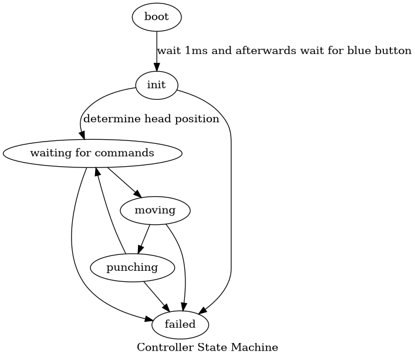

# Použití
Všechny příkazy se voláme z rootu gitového repozitáře se zdrojáky, pokud není řečeno jinak.

1. příprava
	1. flashneme simulátor
	2. zapojíme controller (všechny 3 kabely)
	3. připojíme se sériovou linkou na controller s 115200 baudy
		- např. `picocom /dev/ttyUSB0 -b115200`
	4. volitelně spustíme vizualizaci
2. využívání
	1. po startu controller čeká na modré tlačítko
	2. potom můžeme pozorovat inicializaci
	3. v jednu chvíli se nás pak controller zeptá, kam chceme udělat díru
	4. zadáme do konzole souřadnice
	5. controller na daném místě udělá díru
	6. když má controller hotovo, čeká na další instrukce stejně jako v bodě 3

# Předpoklady
- max rychlost hlavy je 1500 mm/s (odhad s rezervou)
- potřebujeme zpracovat 4 interrupty na každý mm, o který se hlava posune
- máme výkon minimálně na $1500\cdot4\cdot2$ vykonání interrupt handleru za vteřinu
- ==> interrupt handlery strávíme maximálně 50% času
- před uděláním díry musíme mít rychlost v obou osách menší než $1 \frac{mm}{s}$
	- polohu máme přesnout na $0.25mm$
	- ==> když se poloha nezmění $250ms$, je bezpečné dělat díru

# Módy
Běh controlleru si rozdělíme do několika módů podle funcionality. Efektivně tak děláme z controlleru stavový automat. Nepotřebujeme pak dokazovat, že je celý program korektní, stačí to dokazovat pro jednotlivé stavy automatu. Návrh rozdělení na stavy je níže v diagramu:

Víceméně jediné zajímavé stavy jsou `MOVING` a `INIT`. Při nich prakticky dochází k prolínání několika tasků najednou. Jinak je vše sekvenční. (Když nepočítáme systick interrupt handler.)

## `BOOT`
V tomto stavu dochází k několika sekvenčním operacím, jejichž průběh lze sledovat na sériové konzoli.
- controller ověří, že má čip dostatek výkonu bezpečnému běhu
	- Neustále od startu až do resetu si controller na pozadí udržuje informaci o tom, kde se nachází. Tohle dělá pomocí interruptů. Test zde ověřuje, kolik interruptů jsme schopní zpracovávat a kontroluje, že to je dostatek. Pokud při testu vyjde, že na toto není dostatek výkonu, odmítne controller pokračovat.
- počká se na inicializaci hardwaru (čekání alespoň 1ms dle specifikace)
- počká se na uživatele, dokud nezmáčkne modré tlačítko

## `INIT`
V tomto stavu controller zjišťuje, kde se nachází hlava. Motory se zapnou na méně než poloviční výkon. Na pozadí je pomocí interruptů udržovaná informace o pozici, ve zbylých cyklech procesoru se hlídá, zda nejsme u hranice pracovní plochy.

Tento stav je bezpečný, protože efektivně zde probíhají 2 tasky statickými prioritami s preemtivním přepínám:
- Udržování polohy hlavy má vyšší prioritu. Je vyhodnocováno v interruptech, které chodí díky poloviční rychlosti maximálně rychlostí 3000 interruptů za vteřinu. V testu v `BOOT` stavu ověřujeme, že máme výkon minimálně na 12000 interruptů za vteřinu, tudíž tento task má maximálně 25% využití procesoru.
- Druhý task s nižší prioritou hlídá, zda není potřeba otočit směr pohybu hlavy. Běží ve zbytku výkonu procesoru - tak často, jak jen to procesor zvládá. Předpokládáme, že task se vejde do stejného časového slotu jako task na udržování pozice. Máme tudíž jistotu, že se vykonává minimálně tolikrát, kolikrát se vykonávají interrupty. A protože v tomto tasku se pouze reaguje na data z interruptů, můžeme o něm efektivně uvažovat jako o pokračování tasku v interruptu. Reagovat na tomto hardwaru významně dříve víceméně nelze. Spoléháme pak na empirické pozorování, že takto rychlá reakce stačí. Pro přesné spočítání časování bychom potřebovali znát přesné vlastnosti motorů, ke kterým nám chybí specifikace. Mohli bych si data naměřit, ale to se neliší od naměření faktu, že reagujeme dostatečně rychle.

## `WAITING`
V tomto stavu akorát čekáme na data po sériové lince. Jinak se nic neděje.

## `PUNCHING`
Do tohoto stavu vstupujeme ve chvíli, kdy víme, že je bezpečné udělat díru (tzn. nepohybujeme se).

Vše probíhá sekvenčně. Signalizujeme, že má HW udělat díru, počkáme 1ms, přestáváme signalizovat, počkáme 1ms a na závěr aktivně čekáme na signál, že je hlava zvednutá a je bezpečné se dále pohybovat.

## `MOVING`
V tomto stavu se controller chová podobně jako ve stavu `INIT`. Běží zde dva tasky, jeden udržuje aktuální informace o poloze hlavy, druhý provádí samotné řízení.
- Udržování polohy hlavy běží s vyšší prioritou a zatěžuje maximálně 50% procesoru (vychází z empiricky ověřených předpokladů). Zpracování jednoho interruptu trvá nejvýše $0.08ms$ a interrupty chodí nejméně s periodou $0.16ms$.
- Ve všech zbylých cyklech procesoru běží PD controller. Maximální perioda je jedno vykonání za 1ms (protože je to rozlišení našich hodin). Zároveň ale při konstrukci byl control loop laděn tak, aby fungoval bez problémů i při periodě 100ms. A protože vypočítání hodnot PD controlleru je podle měření zhruba 2x tak rychlejší než vyhodnocení interruptu, máme kapacitu na zhruba 12000 iterací PD controlleru za sekundu. Protože task na aktualizaci polohy zatěžuje nejvýše 50% procesoru a zároveň máme garantováno, se mezi dvě vyhodnocení interruptů vejde alespoň jedno vyhodnocení PD controlleru, stíháme tedy určitě vyhodnocovat PD controller častěji než každých $100ms$.

## `FAILURE`
V tomto stavu zahlásíme katastrofální chybu na konzoli a následně dochází k automatickému resetu controlleru (a simulátoru).

# Nástroje v repozitáři

- spuštění vizualizace - `make vis` (možná to nebude fungovat kvůli správnému pojmenování sériového portu)
- flash simulátoru - `make flash-simulator`
- flash vzorového controlleru - `make flash-sample-controller`

Pro build a flashnutí controlleru ze zdrojáků v tomto repozitáři je potřeba otevřít složku `controller` v `stm32cubeide` a alespoň jednou vyvolat build přes IDE. Potom je možné flashovat pomocí `make flash`.
